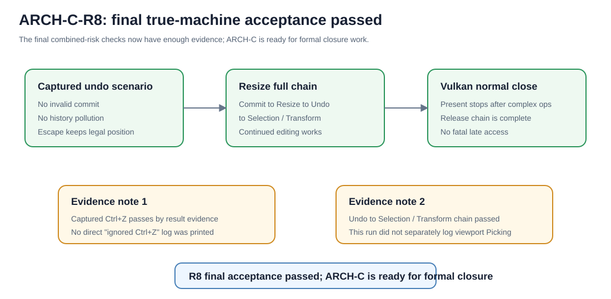

# ARCH-C-R8 最终真机验收报告

## 1. Git 状态

当前运行时代码基线：

```text
版本基线：v0.2.17.33-fix
阶段性报告 HEAD：eaa57b2 docs(editor): record arch-c r8 staged acceptance
分支：fix/RZ-VK3-A-surface-contract
Push：已完成
```

本报告固化的是补测后的验收裁定变化，不引入新的运行时代码语义。

当前口径升级为：

```text
ARCH-C-R8：最终真机验收通过
ARCH-C：具备正式收口条件
```

仍需区分：

```text
ARCH-C 具备正式收口条件 ≠ ARCH-C 正式收口完成
```

正式收口完成还需要本报告、最终状态 SVG、changelog、file-tree、必要计划文档同步后形成 Git 提交并推送。

---

## 2. 文档状态

本轮新增最终验收固化文件：

```text
docs/arch-c-r8-final-acceptance-report.md
docs/arch-c-r8-final-acceptance-status.svg
```

此前阶段性文件保留为历史证据：

```text
docs/arch-c-r8-stage-acceptance-report.md
docs/arch-c-r8-stage-acceptance-status.svg
```

本最终报告撤销此前“未复测风险项”状态，但保留两个证据范围注记，避免夸大日志事实。

---

## 3. 最终验收范围与判定

### 3.1 Captured Ctrl+Z

判定：

```text
通过
```

证据链：

```text
21:30:02 合法 Commit
Before=Vector3d(0, 0, 0)
After =Vector3d(1.382, 0, 0)
History Count=1

21:30:22 Session=2 Begin

21:30:27 Escape Cancel
Session=2
Position=Vector3d(1.382, 0, 0)
```

关键负证据：

```text
Session=2 无 Commit
Session=2 无 History Push
Session=2 无正式 Session End 新位置
前一条合法 History 未被错误撤销
正式 Position 未被破坏
```

因此验收目标满足：

```text
Captured 状态中的 Ctrl+Z 没有观察到破坏当前捕获、正式 Scene 或 History。
```

证据范围注记：

```text
本轮日志未直接打印“Ctrl+Z 被忽略”。
本项按结果证据判定通过：Session=2 捕获期间未提交、未新增 History、未形成新位置，随后 Escape 正常取消，正式 Position 保持前一次合法 Commit 的 Vector3d(1.382, 0, 0)。
```

不得夸大为：

```text
日志明确记录 Ctrl+Z 被输入系统拒绝。
```

---

### 3.2 Commit → Resize → Undo → Selection / Transform 连续链

判定：

```text
通过
```

#### 1. Resize 前合法 Commit

```text
Before=Vector3d(1.382, 0, 0)
After =Vector3d(3.432, 0, 0)
History Count=2
```

#### 2. Resize / Swapchain 自愈

```text
1248x478
→ 1248x1110
Swapchain gen 2 → 3
Present 恢复

1248x1110
→ 1248x478
Swapchain gen 3 → 4
Present 恢复
```

说明：

```text
Resize
→ Swapchain Recreate
→ Framebuffer Rebuild
→ Present 恢复
```

成立。

#### 3. Resize 后 Undo

```text
Before=Vector3d(1.382, 0, 0)
After =Vector3d(3.432, 0, 0)
Remaining=1
```

语义为：

```text
正式 Scene
3.432
→ Undo
→ 1.382
```

#### 4. Undo 后继续 Transform

关键证据：

```text
Session=5 Y
Before=Vector3d(1.382, 0, 0)
After =Vector3d(1.382, 1.927, 0)
```

这证明：

```text
Undo 后的新 Transform 读取到的正式起点，确实是 Undo 恢复后的 Scene 状态。
```

不是旧状态：

```text
Vector3d(3.432, 0, 0)
```

随后连续编辑仍成立：

```text
Session=6
Before=Vector3d(1.382, 1.927, 0)
After =Vector3d(3.811, 1.927, 0)
```

证据范围注记：

```text
本次连续链未单独重新打印 viewport Picking 日志。
本项按“此前 Picking 独立真机通过 + 本轮 Undo 后正式 Scene 状态继续驱动 Selection / Transform”的组合证据收口。
```

不得夸大为：

```text
本轮重新完整验证了 Undo 后 viewport Picking。
```

---

### 3.3 复杂操作后的正常关闭 Vulkan 释放链

判定：

```text
通过
```

已覆盖：

```text
Present 停止
→ Pipeline / Frame 资源
→ Swapchain
→ Device
→ Surface
→ Instance
```

且未观察到：

```text
AccessViolation
后台线程晚到致命访问
未捕获异常
致命重复释放
```

该项保持通过，无需重复补测。

---

## 4. 最终验收矩阵

```text
[x] Picking / Selection
[x] X / Y / Z Transform
[x] Preview / Commit
[x] Commit → History
[x] Undo 主链
[x] 连续 Undo
[x] Escape Cancel
[x] WM_CANCELMODE
[x] 迟到 MouseUp 防复活基础证据

[x] Captured Ctrl+Z
    注：按结果证据判定，未直接打印忽略日志。

[x] Commit → Resize → Undo
[x] Undo 后正式 Scene 恢复正确
[x] Undo 后继续 Transform 使用正确 Before
[x] 连续编辑链保持工作
[x] Resize / Swapchain 自愈

[x] 复杂操作后正常关闭 Vulkan 释放链

[x] LOG-UX 自动滚动
[x] LOG-UX 多选复制 / 焦点修复
```

---

## 5. 可视化

最终状态图：



---

## 6. 最终结论

当前最准确裁定：

```text
ARCH-C-R8 最后三项组合验收：通过
ARCH-C-R8：最终真机验收通过
ARCH-C：具备正式收口条件
```

当前可以说：

```text
ARCH-C 具备正式收口条件。
```

当前还不要说：

```text
ARCH-C 正式收口完成。
```

因为还差最后一次文档与 Git 收口动作：

```text
冻结最终验收结论
→ 更新 R8 最终验收报告
→ 更新最终状态 SVG
→ 移除“未复测风险”状态
→ 保留两条证据范围注记
→ 同步 arch-c-plan / changelog / file-tree
→ 自动守卫复核
→ Commit / Push
→ ARCH-C 正式收口
```

---

## 7. 当前项目进度

| 维度 | 完成度 | 判断依据 |
|---|---:|---|
| ARCH-C 当前阶段完成度 | 99.5% | 功能与真机验收已结束，只差最终文档 / Git 收口动作 |
| Vulkan / 引擎地基完成度 | 约 93% | 核心生命周期、Resize、自愈、真实编辑交互、Undo、复杂操作后关闭均已有较强证据 |
| 奇正相生可试装准备度 | 约 58% | ARCH-C 真实编辑主链已基本成为可靠地基，可转向上层场景与玩法能力 |
| 项目总体完成度 | 约 28% | 引擎核心编辑架构完成重要阶段，但玩法、AI、资产、存档和战争模拟仍是后续主体 |

阻断项：

```text
无功能级阻断。
仅剩流程性收口。
```

