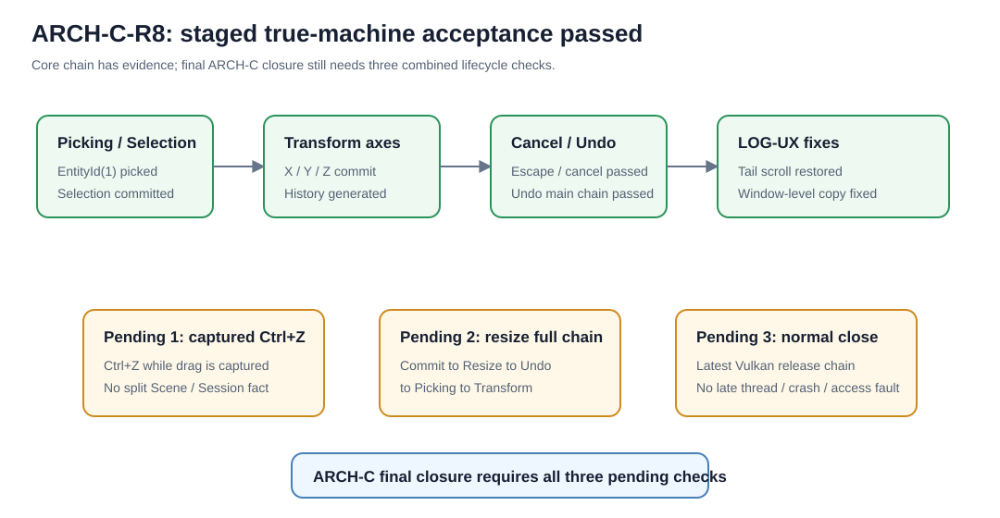

# ARCH-C-R8 阶段性真机验收报告

## 1. Git 状态

当前阶段事实固定为：

```text
版本：v0.2.17.33-fix
HEAD：187fd3e fix(editor): copy selected logs from window focus
分支：fix/RZ-VK3-A-surface-contract
Push：已完成
```

当前裁定必须保持两层：

```text
ARCH-C-R8 阶段性真机验收：通过
ARCH-C 最终收口：暂不通过
```

原因不是发现新的 P0 失败，而是最终验收证据仍缺 3 条完整组合闭环。

---

## 2. 文档状态

当前 R8 / LOG-UX 相关可视化文档至少包括：

```text
docs/log-ux-r8-tail-noise-fix.svg
docs/log-ux-window-copy-focus-fix.svg
docs/arch-c-r8-stage-acceptance-status.svg
```

报告标题必须使用：

```text
ARCH-C-R8 阶段性真机验收报告
```

不能提前写成：

```text
ARCH-C-R8 最终验收通过
```

因为二者代表完全不同的工程状态。

---

## 3. 验收范围与结果

### 3.1 已有充分真机证据的主链

| 验收项目 | 当前判定 | 证据口径 |
|---|---|---|
| Picking | 通过 | `视口拾取完成；结果=EntityId(1)` |
| Selection | 通过 | `选择已提交；结果=EntityId(1)` |
| X Transform | 通过 | `Axis=X` → History → Commit → Session End |
| Y Transform | 通过 | `Axis=Y` → History → Commit → Session End |
| Z Transform | 通过 | `Axis=Z` → History → Commit → Session End |
| Escape Cancel | 通过 | `取消捕获` + `原因=Escape` |
| WM_CANCELMODE | 通过 | `会话取消，原因=WM_CANCELMODE` |
| 日志自动滚动 | 通过 | 新日志持续跟随最新行 |
| LOG-UX 多选复制修复 | 修复完成 | `v0.2.17.33-fix` 已完成窗口级 `Ctrl+C` 路由修复并 Push |

以上已经能够证明：

```text
Picking
→ Selection
→ Transform Begin
→ Preview
→ Commit
→ History
```

这条 ARCH-C 主编辑链在真机上成立。

### 3.2 Undo 当前判定

已有证据：

```text
【ARCH-C-R7】执行撤销
Remaining=2
Remaining=1
```

说明：

```text
连续 Commit
→ History 入栈
→ Ctrl+Z
→ History 按 LIFO 递减
```

是真机工作的。

因此可写：

```text
Undo 主链通过
```

但不能扩大表述成：

```text
Undo 与所有 Session / Resize / Vulkan 生命周期组合均已最终验证
```

因为这正是剩余 3 条专项里仍需补齐的组合证据。

### 3.3 迟到 MouseUp 当前判定

现有证据表明：

```text
Escape Cancel
→ 后续未出现 提交捕获
→ 后续未出现 记录编辑历史
→ 后续未出现旧 Session 会话结束并写入新位置
```

因此应判定为：

```text
基本通过 / 与既有 R5 专项证据共同支持通过
```

不要写成“本轮重新完整复现了全部迟到 MouseUp 专项”，因为当前证据更准确的含义是：旧 Session 没有观察到复活提交。

---

## 4. 可视化与人工验收

阶段状态图：



最后 3 条真机验收建议一次性完成。

### 4.1 捕获中 Ctrl+Z

先制造一条合法历史：

```text
A → Commit B
```

然后：

```text
Begin 新拖动
→ Preview C
→ 保持鼠标捕获中
→ 按 Ctrl+Z
```

预期：

```text
[PASS] 不执行旧 History Undo
[PASS] Scene 不从 B 退回 A
[PASS] 当前 StartSnapshot 仍然一致
[PASS] Escape 仍可正常 Cancel 当前 Preview
[PASS] Cancel 后 History 仍指向 A→B
```

这是 P0。

### 4.2 Commit → Resize → Undo → Picking → Transform

建议严格连续操作：

```text
A
→ X 轴拖动 Commit 到 B
→ Resize 窗口
→ 确认 Swapchain generation 更新
→ Ctrl+Z 回 A
→ 点击实体重新 Picking
→ 再执行 Y 或 Z 轴拖动
→ Commit C
```

必须：

```text
[PASS] Resize 后 Undo 恢复 A
[PASS] Undo 不额外触发 Swapchain 重建
[PASS] Undo 后 Picking 命中当前真实位置
[PASS] 新 Transform 从 Undo 后的 A 开始
[PASS] 新 Commit 正常进入 History
[PASS] Present 不发生无意义 Stop / Start
```

这条一次性验证：

```text
Scene / History / Viewport / WorldRay / Picking / Transform / Vulkan
```

是否真正一致。

### 4.3 正常关闭释放链

完成上面的复杂连续操作后直接关闭窗口。

至少确认：

```text
Present 停止
→ 渲染相关资源释放
→ Swapchain 释放
→ Device 释放
→ Surface 释放
→ Instance 释放
```

并确认：

```text
[PASS] 无 AccessViolation
[PASS] 无后台线程晚到访问
[PASS] 无重复释放致命错误
[PASS] 无未捕获异常
```

不要只做“启动后立刻关闭”的轻量测试；应在 Picking / Transform / Undo / Resize / 再 Transform 后关闭。

---

## 5. 最终结论

当前准确结论固定为：

```text
ARCH-C-R8：阶段性真机验收通过
ARCH-C：尚未最终封板
```

ARCH-C 已经有真机证据支持：

```text
Scene
→ Picking
→ Selection
→ X/Y/Z Transform
→ Commit
→ History
→ Undo
```

同时：

```text
Escape Cancel
WM_CANCELMODE
旧 Session 防复活基础证据
LOG-UX 自动滚动
LOG-UX 多选复制
```

也已经有较强证据或完成修复。

因此 R8 不是“还没验多少”，而是已经进入：

```text
最终三个组合闭环的收口复核阶段
```

尚不能宣布最终通过的原因仅剩：

```text
1. Captured 状态 Ctrl+Z
2. Commit → Resize → Undo → Picking → Transform 完整连续链
3. 最新版本复杂操作后的正常关闭释放链
```

这 3 项全部是组合生命周期证据，不是要求再开发新功能。

三项全部 PASS 后，才可正式输出：

```text
ARCH-C-R8 最终验收通过
ARCH-C 正式收口
```

---

## 6. 当前项目进度

```text
当前版本：v0.2.17.33-fix
当前 HEAD：187fd3e
当前阶段：ARCH-C-R8 最终收口前复核阶段
```

| 维度 | 完成度 | 判断依据 |
|---|---:|---|
| ARCH-C 当前阶段完成度 | 约 98% | 核心主链已有真机证据，仅剩 3 个最终组合生命周期场景 |
| Vulkan / 引擎地基完成度 | 约 91% | Resize、Present、自愈、Transform、Undo 已分别或部分组合验证 |
| 奇正相生可试装准备度 | 约 52% | 编辑器基础已具备，但玩法、内容、资产、AI、存档仍属后续主体工程 |
| 项目总体完成度 | 约 26% | 引擎核心编辑地基取得阶段性完成，但完整产品仍在早期 |

### 阻断项

当前没有已知代码级硬阻断。唯一阻断是：

```text
最终证据尚未完整
```

